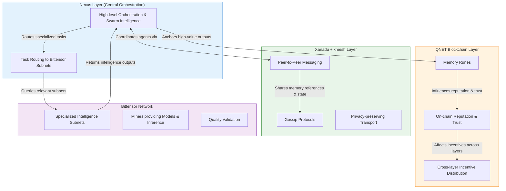

# Bittensor Integration

This document explores how **Bittensor** can be integrated into the Nexus ecosystem as part of the Layered AI Agent Swarm Coordination Architecture.

## Overview

Bittensor is a decentralized machine learning network where participants (miners) provide intelligence and are rewarded in TAO. It is organized into specialized subnets.

As the central orchestration hub, **Nexus** can leverage Bittensor to significantly enhance the intelligence capabilities of agent swarms while working alongside:

- **QNET** (blockchain incentives & coordination)
- **Xanadu + xmesh** (communication layer)
- **Cyberspace** (immersive & narrative layer)

## Integration Goals

- Augment agent and swarm intelligence using decentralized models
- Leverage Bittensor subnets for specialized tasks (reasoning, narrative generation, embeddings, evaluation)
- Explore hybrid incentive mechanisms between TAO and XCoin/QCoin
- Improve overall swarm coordination and emergent behavior through external intelligence

## Architecture Diagram

## Integration Models

### 1. Bittensor as Intelligence Provider (Recommended)

Nexus intelligently routes tasks to the most suitable Bittensor subnets:

- Narrative & creative generation → Text / Image / Storytelling subnets
- Complex reasoning & decision making → Reasoning subnets
- Semantic memory retrieval → Embedding / Vector subnets
- Agent performance evaluation → Evaluation subnets

### 2. Hybrid Incentive & Reputation Layer

- High-quality contributions on Bittensor can positively influence reputation on QNET
- Memory Runes can reference or anchor important Bittensor outputs for verifiability
- Future exploration of cross-network staking or reward bridging between TAO and XCoin

### 3. Custom Bittensor Subnet (Long-term Option)

Develop or participate in a dedicated Bittensor subnet focused on:
- Multi-agent swarm coordination
- Narrative intelligence and world simulation
- Decentralized memory management and retrieval

## Benefits of Integration

- Access to a growing ecosystem of decentralized, incentivized AI capabilities
- Reduced infrastructure burden for running large models
- Strong existing economic mechanisms in Bittensor
- Potential for emergent intelligence through hybrid systems

## Challenges & Considerations

- Increased architectural complexity
- Latency introduced by cross-network interactions
- Need for economic bridging or alignment between TAO and XCoin
- Dependency management across multiple decentralized networks

## Recommended Approach

Adopt a **phased, lightweight integration** strategy:

1. Start by allowing Nexus to query existing high-quality Bittensor subnets for specific tasks.
2. Anchor important outputs and decisions using Memory Runes on QNET for persistence and verifiability.
3. Monitor performance and value, then evaluate building or joining a custom "Agent Swarm Intelligence" subnet in the future.

## Open Questions

- What is the ideal balance between deep integration (custom subnet) vs lightweight usage of existing subnets?
- How should economic incentives and reputation be aligned or bridged between TAO and XCoin/QCoin?
- Which existing Bittensor subnets currently offer the highest immediate value for swarm coordination and narrative generation?

---

*Part of the Nexus Central Integration Hub.*